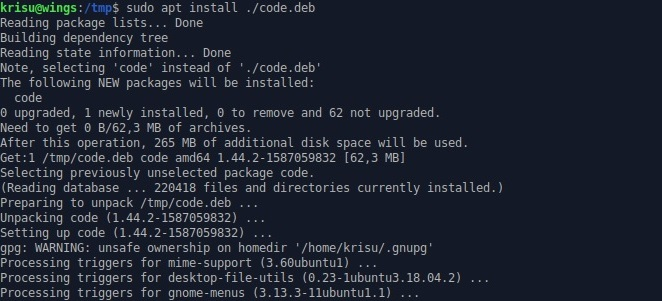
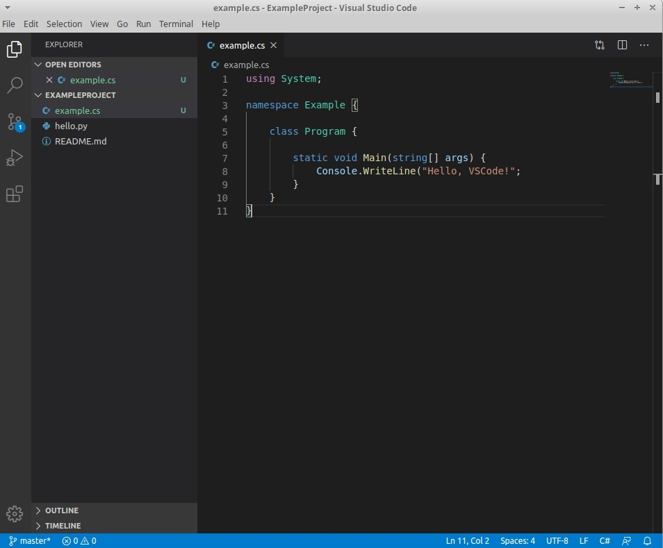
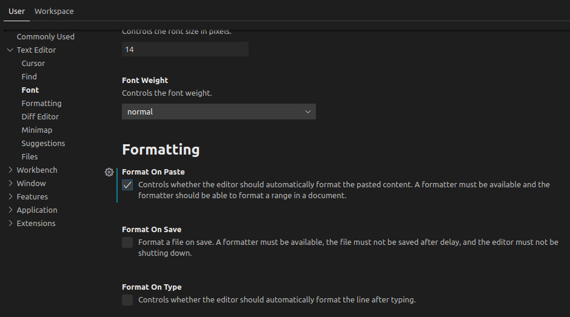

# H3 Versionhallinta raportti 
#### 21.04.2020 - Kristian Koponen  
## Sisällysluettelo  

[Tehtävänanto](#tehtävänanto)  
[Esitietoa](#esitietoa)  
[Alkutoimet](#alkutoimet)  
[a) Muutoksien seuranta ('git log', 'git diff', 'git blame')](#a-muutoksien-seuranta-git-log-git-diff-git-blame)  
&nbsp;&nbsp;&nbsp;&nbsp;&nbsp;&nbsp;[- git log](#git-log)  
&nbsp;&nbsp;&nbsp;&nbsp;&nbsp;&nbsp;[- git diff](#git-diff)  
&nbsp;&nbsp;&nbsp;&nbsp;&nbsp;&nbsp;[- git blame](#git-blame)  
[b) Vanhempaan versioon paluu ('git reset --hard')](#b-vanhempaan-versioon-paluu-git-reset-\--hard)  
[c) Uusi Salt-moduli](#c-uusi-salt\-moduli)  
&nbsp;&nbsp;&nbsp;&nbsp;&nbsp;&nbsp;[- Asennus manuaalisesti](#vs-code-asennus-manuaalisesti)  
&nbsp;&nbsp;&nbsp;&nbsp;&nbsp;&nbsp;[- Konfigurointi manuaalisesti](#vs-code-konfigurointi-manuaalisesti)  
&nbsp;&nbsp;&nbsp;&nbsp;&nbsp;&nbsp;[- Asennus SaltStackilla](#vs-code-asennus-saltstackilla)  
&nbsp;&nbsp;&nbsp;&nbsp;&nbsp;&nbsp;[- Konfigurointi SaltStackilla](#vs-code-konfigurointi-saltstackilla)  

---

## Tehtävänanto
[Palvelinten Hallinta H3 - terokarvinen.com](http://terokarvinen.com/2020/configuration-managment-systems-palvelinten-hallinta-ict4tn022-spring-2020/#h3-versionhallinta)

    MarkDown. Tee tämän tehtävän raportti MarkDownina. Helpointa on tehdä raportti GitHub-varastoon, jolloin md-päätteiset tiedostot muotoillaan automaattisesti. Tyhjä rivi tekee kappalejaon, risuaita ‘#’ tekee otsikon, sisennys merkitsee koodinpätkän.

    a) Näytä omalla git-varastollasi esimerkit komennoista ‘git log’, ‘git diff’ ja ‘git blame’. Selitä tulokset.

    b) Tee tyhmä muutos gittiin, älä tee commit:tia. Tuhoa huonot muutokset ‘git reset –hard’. Huomaa, että tässä toiminnossa ei ole peruutusnappia.

    c) Tee uusi salt-moduli. Voit asentaa ja konfiguroida minkä vain uuden ohjelman: demonin, työpöytäohjelman tai komentokehotteesta toimivan ohjelman. Käytä tarvittaessa ‘find -printf “%T+ %p\n”|sort’ löytääksesi uudet asetustiedostot. (Tietysti eri ohjelma kuin aiemmissa tehtävissä, tarkoitushan on harjoitella Salttia)

---

## Esitietoa
| VirtualBox 6.14 | xubuntu 18.04.4 amd64 ISO |
|---              |---                        |

#### Huom! Virtuaalikoneelle on jo asennettu SaltStack ja sen master on jo konfiguroitu, sekä kaksi minion-konetta hyväksytty. [Palvelinten Hallinta H1, H2](https://kopkr.github.io/task-palhal) 

---

## Alkutoimet
Asennetut paketit

    sudo apt-get update && sudo apt-get install python3 git curl

Luodaan uusi projektikansio, MarkDown README-tiedosto ja Hello World pythonilla.

    $ mkdir ExampleProject
    $ cd ExampleProject
    $ nano README.md
    $ cat README.md 
    ## This is an example project.
    $ nano helloworld.py
    $ nano hello.py
    $ cat hello.py 
    print("Hello, git!")

Alustetaan git-projekti ja kommitoidaan projektin kaikki tiedostot.

    $ git init
    Initialized empty Git repository in ~/Code/ExampleProject/.git/
    $ git add .
    $ git commit

Huom! Tällä koneella on jo luotu gitin asetuksiin globaalit tiedot käyttäjästä. Alla komennot, joilla nämä voidaan asettaa.

    $ git config --global user.name "Nimi"
    $ git config --global user.email "Sähköposti"

Nämä näkyvät jokaisen kommitoinnin yhteydessä.

---

## a) Muutoksien seuranta ('git log', 'git diff', 'git blame')

### Git log

Git log on komento, joka näyttää git-projektin kommitointilokit.

    $ git log
    commit ae8f9010156582c9b2e1099f7e98690fee4d12e7 (HEAD -> master)
    Author: krisu <krisu>
    Date:   Tue Apr 21 18:49:39 2020 +0300

        First commit

Tällä hetkellä näkyy vain yksi kommitointi. Kyseisestä tapahtumasta näkyy kommitoinnin hash-koodi, henkilö joka kommitoinnin teki, päivämäärä ja aika sekä viesti, jolla kuvaillaan muutoksia. 

### Git diff

Git diff on komento, joka näyttää kommitointien väliset erot. Tällä hetkellä mitään muutoksia ei näy sillä ollaan tehty vain yksi kommitointi, eikä mitään olla muutettu.
Tehdään muutoksia. 

    $ nano hello.py
    $ cat hello.py
    print("Hello, git diff!")

Nyt ennen kuin lisätään tiedosto uuteen kommitointiin voidaan nähdä muutokset nykyisen tiedostorakenteen ja viimeisimmän kommitoinnin välillä.

    $ git diff
    diff --git a/hello.py b/hello.py
    index aadab71..796cde8 100644
    --- a/hello.py
    +++ b/hello.py
    @@ -1 +1 @@
    -print("Hello, git!")
    +print("Hello, git diff!")

Tuloste näyttää mitä tiedostoa ollaan muokattu, sekä muutettujen rivien erot.  
Kommitoidaan tiedosto.

    $ git add hello.py
    $ git commit -m "Change print output"

Voidaan myös tarkastella kommitointien välisiä eroja jälkikäteen syöttämällä parametriksi kommitointien hash-koodit eroteltuna kahdella pisteellä. Alkupätkä tästä riittää, kunhan se yksilöi kommitoinnin.

    $ git log
    commit 1813dea4baf100efbb6dd7415a31b6be61534c96 (HEAD -> master)
    Author: krisu <krisu>
    Date:   Tue Apr 21 18:51:32 2020 +0300

        Change print output

    commit ae8f9010156582c9b2e1099f7e98690fee4d12e7
    Author: krisu <krisu>
    Date:   Tue Apr 21 18:49:39 2020 +0300

        First commit
    $ git diff ae8f90..1813de
    diff --git a/hello.py b/hello.py
    index aadab71..796cde8 100644
    --- a/hello.py
    +++ b/hello.py
    @@ -1 +1 @@
    -print("Hello, git!")
    +print("Hello, git diff!")

### Git blame
Git blame komento näyttää tietoa yksittäisten rivien kohdalla tehdyistä muutoksista. Git blame tarvitsee parametriksi tiedoston, jota halutaan tarkastella. Tässä tapauksessa hello.py -tiedosto

    $ git blame hello.py
    1813dea4 (krisu 2020-04-21 18:51:32 +0300 1) print("Hello, git diff!")

Tästä nähdään muutoksen hash, kuka kyseisen muutoksen on tehnyt, kellonaika, rivinumero ja kyseisen rivin sisältö tällä hetkellä.  
Tehdään uusi rivi hello.py -tiedostoon.

    $ nano hello.py
    $ cat hello.py 
    print("Hello, git diff!")
    print("Hello again")

Kokeillaan uudelleen git blame.

    $ git blame hello.py
    1813dea4 (krisu             2020-04-21 18:51:32 +0300 1) print("Hello, git diff!")
    00000000 (Not Committed Yet 2020-04-21 18:55:54 +0300 2) print("Hello again")

Nyt nähdään että git blame näyttää mitä riviä ei olla vielä kommitoitu.

---

## b) Vanhempaan versioon paluu ('git reset --hard')

Jos riviä ei nyt halutakaan kommitoida, vaan halutaan palata vanhaan versioon voidaan käyttää git reset komentoa. Tätä ei voi peruuttaa, joten jos muutokset halutaan säilyttää on hyvä ottaa varmuuskopio tiedostosta talteen ensin.

    $ cp hello.py ../backuphello.py
    $ ls ..
    backuphello.py  ExampleProject

Palataan viimeisimpään kommitointiin.

    $ git reset --hard
    HEAD is now at 1813dea Change print output

Tulosteesta nähdään kommitoinnin hash-koodi, johon ollaan palattu ja sen viesti. Testataan vielä että tiedosto on vanhempi versio.

    $ cat hello.py 
    print("Hello, git diff!")
---
## c) Uusi Salt-moduli

Pyrin tässä tehtävässä asentamaan Visual Studio Code ohjelman Xubuntu-virtuaalikoneelleni.

### VS Code asennus manuaalisesti

Visual Studio Coden saa [ladattua](https://code.visualstudio.com/download) .deb pakettina. Katsotaan paketin sijainti latauslinkin pohjalta ja ladataan tmp kansioon nimellä 'vscode.deb'

    $ cd /tmp
    $ curl -I https://go.microsoft.com/fwlink/?LinkID=760868
    Location: https://vscode-update.azurewebsites.net/latest/linux-deb-x64/stable
    $ wget -O code.deb 'https://vscode-update.azurewebsites.net/latest/linux-deb-x64/stable'

Käytetään apt paketinhallinta-ohjelmaa asennukseen kuten [VS Coden](https://code.visualstudio.com/docs/setup/linux) ohjesivuilla lukee.

    $ sudo apt install ./code.deb

Tuloste näyttää hieman suppealta, mutta Visual Studio Code on asentunut koneelle. Loin testauksen vuoksi aiempaan ExampleProject kansioon ohjelmalla example.cs tiedoston.

    $ cat ~/Code/ExampleProject/example.cs 
    using System;

    namespace Example {

        class Program {

            static void Main(string[] args) {
                Console.WriteLine("Hello, VSCode!";
            }
        }
    }

Näyttää toimineen oletetusti.

### VS Code konfigurointi manuaalisesti

Halutaan, että VS Code muotoilee pastetun tekstin oikeaan muotoon.
Asetuksista "File > Preferences > Text Editor > Font" laitetaan ruksi kohtaan "Format On Paste"

Katsotaan mitä tiedostoa asetus muokkasi. Alla olevalla komennolla haetaan tiedostot kansioista /etc ja /home, sekä tulostetaan niiden aika ja polku. Järjestetään niin että viimeisin muokkaus tulee alimmaiseksi.

    $ find /etc/ $HOME -printf '%T+ %p\n'|sort
    ...
    2020-04-21+21:04:57.9880851360 /home/krisu/.config/Code/User/settings.json

Listauksen pohjalta näkyi muutoksia useassa tiedostossa, mutta olennaisimpana on settings.json  
Katsotaan mitä tässä tiedostossa näkyy.

    $ cat ~/.config/Code/User/settings.json 
    {
        "editor.formatOnPaste": true
    }

Näyttää siltä, että settings.json näyttää vain käyttäjäkohtaiset asetukset, jotka poikkeavat oletusasetuksista. Koitan tässä vaiheessa löytää missä oletusasetukset ovat piilossa. Pitkän tiedostojen selailun jälkeen päätän kysyä hakukoneelta. Muutamat stackoverflow-ketjut paljastavat, että oletusasetukset ovat kovakoodattu ohjelmaan, joten niitä ei noin vain muuteta.

Täytyy tyytyä muuttamaan asetusta käyttäjäkohtaisesti.

### VS Code asennus SaltStackilla

Koska Visual Studio Codea ei ollut apt paketointijärjestelmässä, asennus ei toimi tuttuun tapaan pkg.installed toiminnolla. Tilan on todennäköisesti ladattava samalla tavalla .deb paketti ja ajettava shell-komennolla, kuten itse tein manuaalisesti. Löysin Github Gististä valmiin SLS-tiedoston, jolla juuri edellä mainittu onnistuu. [cprior/srv-salt-vscode.sls](https://gist.github.com/cprior/89c4aa76df9f8d8aa4616ca63580eb1f)

Luodaan kansio asennukselle /srv/salt kansioon. Sinne init.sls tiedosto.

    $ cd /srv/salt
    $ sudo mkdir vscode
    $ sudoedit /vscode/init.sls
    $ cat /vscode/init.sls
    install Visual Studio Code:
      cmd.run:
        - name: dpkg -i /tmp/code.deb
        - unless: dpkg -s code
        - require:
        - file: /tmp/code.deb

    #curl -I https://go.microsoft.com/fwlink/?LinkID=760868
    #Location: https://vscode-update.azurewebsites.net/latest/linux-deb-x64/stable
    /tmp/code.deb:
      file.managed:
        - skip_verify: true
        - source: https://vscode-update.azurewebsites.net/latest/linux-deb-x64/stable

#### Ylläolevaa tiedostoa avattu hieman.  
Toisin kuin itse asensin "apt" pakettimanageria käyttäen, tämä käyttää debianin "dpkg" pakettimanageria.
cmd.run -funktio suorittaa nimetyn komennon (dpkg -i /tmp/code.deb) komentorivillä, paitsi jos paketti "code" on jo asennettu, jonka se tarkastaa dpkg:n -s parametrilla.  
Asennus vaatii myös, että /tmp/code.deb tiedosto on olemassa.

Alla oleva file.managed -funktio tarkastaa, että code.deb -tiedosto on paikallaan ja tarvittaessa hakee sen lähteeksi viitatusta osoitteesta.

Kokeillaan ajaa.

    $ sudo salt 'wings' state.apply vscode
    wings:
    ----------
             ID: /tmp/code.deb
       Function: file.managed
         Result: True
        Comment: File /tmp/code.deb updated
        Started: 22:40:13.760286
       Duration: 6763.765 ms
        Changes:   
                ----------
                diff:
                    New file
                mode:
                    0644
    ----------
             ID: install Visual Studio Code
       Function: cmd.run
           Name: dpkg -i /tmp/code.deb
         Result: True
        Comment: unless execution succeeded
        Started: 22:40:20.524255
       Duration: 74.468 ms
        Changes:   

    Summary for wings
    ------------
    Succeeded: 2 (changed=1)
    Failed:    0
    ------------
    Total states run:     2
    Total run time:   6.838 s

Komento latasi .deb tiedoston /tmp/ kansioon, josta se oli manuaalisen asennuksen ja tämän testin välillä poistettu. SaltStack tarkisti myös onko "code"-pakettia asennettu. Oli, joten asialle ei tehty mitään. Tila ajettu onnistuneesti.

### VS Code konfigurointi SaltStackilla

Haetaan aiemmin ilmi tullut settings.json tiedosto vscode-tilan templates kansioon.

    $ sudo mkdir /vscode/templates
    $ sudo cp ~/.config/Code/User/settings.json vscode/templates/

Muokataan init.sls tiedostoa ja lisätään loppuun.

    $ sudoedit vscode/init.sls
    $ cat vscode/init.sls
    ...
    vscode.userconf:
      file.managed:
        - names:
          - /etc/skel/.config/Code/User/settings.json 
          - /home/krisu/.config/Code/User/settings.json 
        - source: salt://vscode/templates/settings.json
        - makedirs: True

file.managed funktio lisää tässä krisu-käyttäjän kotihakemistoon tarvittavat asetustiedoston. Se lisää myös /etc/skel/ hakemistoon saman tiedoston. skel/ kansiosta tulee uusien käyttäjien kotihakemistojen sisältö, eli kun uusi käyttäjä luodaan, niin tämä saa heti uuden asetustiedoston käyttöönsä.

Ajetaan tila.

    $ sudo salt 'wings' state.apply vscode
    wings:
    ----------
             ID: /tmp/code.deb
       Function: file.managed
         Result: True
        Comment: File /tmp/code.deb is in the correct state
        Started: 23:15:34.554357
       Duration: 506.439 ms
        Changes:   
    ----------
             ID: install Visual Studio Code
       Function: cmd.run
           Name: dpkg -i /tmp/code.deb
         Result: True
        Comment: unless execution succeeded
        Started: 23:15:35.061039
       Duration: 69.629 ms
        Changes:   
    ----------
             ID: vscode.userconf
       Function: file.managed
           Name: /etc/skel/.config/Code/User/settings.json
         Result: True
        Comment: File /etc/skel/.config/Code/User/settings.json updated
        Started: 23:15:35.130942
       Duration: 21.2 ms
        Changes:   
                ----------
                diff:
                    New file
                mode:
                    0644
    ----------
             ID: vscode.userconf
       Function: file.managed
           Name: /home/krisu/.config/Code/User/settings.json
         Result: True
        Comment: File /home/krisu/.config/Code/User/settings.json is in the correct state
        Started: 23:15:35.152284
       Duration: 10.71 ms
        Changes:   

    Summary for wings
    ------------
    Succeeded: 4 (changed=1)
    Failed:    0
    ------------
    Total states run:     4
    Total run time: 607.978 ms

Kaikki meni onnistuneesti läpi. /etc/skel/ kansioon luotiin uusi tiedosto ja loput olivat jo kunnossa.